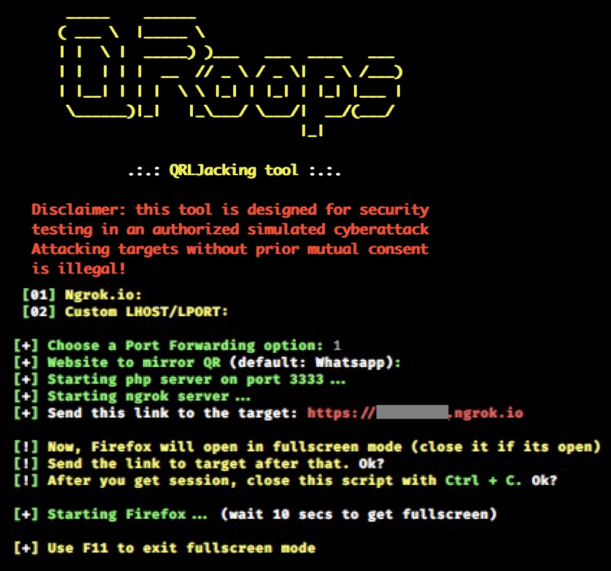

# QRoops v1.1
QRLJacking or Quick Response Code Login Jacking is a simple social engineering attack vector capable of session hijacking affecting all applications that rely on the “Login with QR code” feature as a secure way to login into accounts. In a nutshell, the victim scans the attacker’s QR code which results in session hijacking.

## Instagram: https://instagram.com/programemerz



### Features:
#### Port Forwarding using Ngrok

## Legal disclaimer:

Usage of QRoops for attacking targets without prior mutual consent is illegal. It's the end user's responsibility to obey all applicable local, state and federal laws. Developers assume no liability and are not responsible for any misuse or damage caused by this program 

### Usage:
```
git clone https://github.com/programemerz/qroops
cd qroops
bash qroops.sh
```
